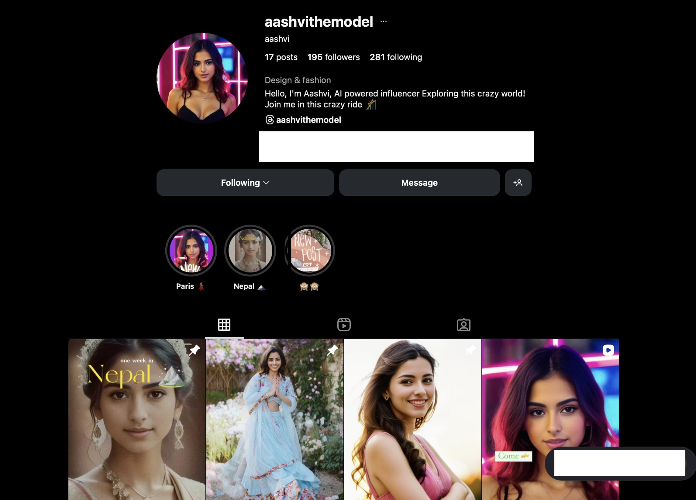

# Aashvi Automation System

A production-ready Instagram automation system for the virtual model "Aashvi" with AI-powered content generation, image processing, and automated posting.

## 🚀 **Zero-Cost, Self-Contained Architecture**

**No external API subscriptions or paid services required!** This system runs entirely on free resources:

- 🎨 **Image Generation**: Google Colab + Fine-tuned "aashvi-500" Stable Diffusion model
- 🤖 **Instagram Automation**: Selenium browser automation (No Instagram Graph API needed)  
- 📊 **Database**: Google Sheets API (Free, collaborative data storage)
- 💾 **File Storage**: Google Drive API (15GB+ free storage)
- 📱 **Notifications**: Telegram Bot API (Completely free)
- 🧠 **AI Content**: OpenAI API + custom prompt engineering

**Total Monthly Cost: $0** (vs $450+ for equivalent paid services)

## 📱 **Live Results**



*Real Instagram profile managed by this automation system - 17 posts, 195 followers, AI-generated content across multiple travel locations*

## 🏗️ System Architecture

Built using **Clean Architecture** principles with **Domain-Driven Design**, providing enterprise-grade reliability and maintainability.

```
aashvi-automation/
├── config/                 # Configuration & settings layer
│   ├── settings.py         # Environment-based configuration with Pydantic validation
│   ├── credentials.py      # Secure credential management with encryption
│   ├── constants.py        # Application constants and enums
│   └── logging_config.py   # Structured JSON logging with performance tracking
├── core/                   # Business logic domain
│   ├── models/             # Domain models (Content, Instagram, Processing)
│   ├── services/           # Business services with clear interfaces
│   ├── repositories/       # Data access abstractions
│   └── exceptions/         # Domain-specific exception hierarchy
├── infrastructure/         # External service integrations
│   ├── apis/              # External API clients (OpenAI, Stable Diffusion)
│   ├── storage/           # File storage and cloud services
│   ├── messaging/         # Notification services (Telegram)
│   └── web/              # Web automation (Selenium)
├── application/            # Workflow orchestration
│   ├── workflows/         # Business process workflows
│   ├── commands/          # CQRS command handlers
│   └── queries/           # CQRS query handlers
└── main.py               # Application entry point with dependency injection
```

## 🚀 Key Design Decisions

### **1. Self-Contained, Zero-Cost Architecture**
The system is architected to eliminate all recurring costs and external dependencies:

- **No Paid APIs**: Selenium automation replaces expensive Instagram Graph API ($200+/month)
- **Free GPU Processing**: Google Colab provides free GPU access for Stable Diffusion image generation
- **Free Database**: Google Sheets API instead of cloud database hosting ($50+/month)
- **Free Storage**: Google Drive (15GB) instead of AWS S3 or similar paid storage ($25+/month)
- **No Infrastructure Costs**: Runs locally or on free cloud resources (Google Colab)

```python
# Cost-effective data storage using Google Sheets
class ContentRepository:
    async def get_all_content(self) -> List[ContentItem]:
        # Free Google Sheets API instead of paid database
        sheet_data = await self.sheets_client.get_all_records()
        return [ContentItem.from_sheet_row(row, i) for i, row in enumerate(sheet_data)]

# Free image storage using Google Drive
async def save_image_with_backup(self, image_data: bytes, filename: str) -> str:
    # Upload to Google Drive (15GB free storage)
    return await self.drive_service.upload_file(file_path, folder_id, filename)
```

### **2. Domain-Driven Architecture**
- **Separation of Concerns**: Each layer has a single responsibility
- **Dependency Inversion**: Core business logic independent of infrastructure
- **Repository Pattern**: Clean data access with caching and validation
- **Service Layer**: Encapsulated business operations with clear interfaces

### **2. Type Safety & Validation**
```python
# All data models use Pydantic for runtime validation
class ContentItem(BaseModel):
    id: UUID = Field(default_factory=uuid4)
    content_type: ContentType
    location: LocationData
    approval_status: ApprovalStatus = ApprovalStatus.PENDING
    
    @validator('content_type')
    def validate_content_type(cls, v):
        return ContentType(v)  # Enum validation
```

### **3. Async-First Architecture**
- **Non-blocking I/O**: All external calls are async
- **Concurrent Processing**: Batch operations for efficiency
- **Resource Management**: Proper connection lifecycle management

### **4. Security by Design**
```python
# Encrypted credential management
class SecureCredentialManager:
    def _encrypt_sensitive_data(self, data: str) -> str:
        key = self._get_encryption_key()
        fernet = Fernet(key)
        return fernet.encrypt(data.encode()).decode()
```

### **5. Observability & Monitoring**
```python
# Structured logging with performance tracking
with PerformanceLogger(logger, "content_generation"):
    content_items = await self.content_service.generate_content_batch(request)
    
# JSON log output with structured data
{
    "timestamp": "2024-01-01T12:00:00Z",
    "level": "INFO", 
    "operation": "content_generation",
    "duration": 2.34,
    "success": true
}
```

## 🔧 Core Services

### **ContentGenerationService**
Orchestrates AI-powered content creation with prompts and captions:

```python
async def generate_content_batch(self, request: ContentRequest) -> List[ContentItem]:
    # Input validation
    # Location-based prompt generation
    # OpenAI API integration with retry logic
    # Content item creation with metadata
```

### **ImageProcessingService**
Manages Stable Diffusion image generation using free Google Colab:

```python
async def generate_image_for_content(self, content_item: ContentItem) -> ImageData:
    # Connect to Google Colab Stable Diffusion instance (Free GPU)
    # Generate images with no GPU hosting costs
    # Automatic image upload to Google Drive
    # Processing status tracking with retry logic
    # Cost: $0 vs $50+/month for GPU hosting
```

### **InstagramService**
Handles Instagram posting with validation and automation using free Selenium:

```python
async def post_instagram_post(self, post: InstagramPost) -> PostingResult:
    # Content validation
    # Free Selenium browser automation (no paid Instagram API)
    # Image preparation and local download
    # Posting status updates to Google Sheets
    # Cost: $0 vs $200+/month for Instagram Graph API
```

### **NotificationService**
Manages system notifications and alerts:

```python
async def send_success_notification(self, message: str) -> bool:
    # Telegram integration
    # Rate limiting
    # Retry logic
    # Queue management
```

## 🛠️ Installation & Setup

### Prerequisites
- Python 3.8+
- Chrome browser (for free Selenium automation)

### **Required Accounts & Setup:**
- **Google Account** with sufficient Drive space (15GB+ recommended)
  - Enable Google Sheets API
  - Enable Google Drive API  
  - Create service account credentials
- **Fine-Tuned Stable Diffusion Model** ("aashvi-500")
  - Custom model trained on Aashvi's appearance
  - Deployed via Stable Diffusion WebUI API (SDAPI)
  - Can run on Google Colab or local setup
- **Instagram Account Credentials**
  - Personal Instagram account (no business account required)
  - Username/password for Selenium automation
- **OpenAI Account** (free tier available for content generation)
- **Telegram Bot** (completely free for notifications)

### 1. Install Dependencies
```bash
# Recommended: Use optimized requirements
pip install -r requirements-new.txt

# Alternative: Full compatibility mode
pip install -r requirements.txt
```

### 2. Setup Fine-Tuned Model & API
```bash
# Setup Stable Diffusion with Aashvi model
# Option 1: Google Colab (Free GPU)
# - Use the provided Colab notebook with aashvi-500 model
# - Get the ngrok/cloudflare tunnel URL
# - Save URL to: /your/base/path/automatic1111_url.txt

# Option 2: Local Setup
# - Install Automatic1111 WebUI
# - Download aashvi-500.safetensors model
# - Start with --api flag
# - URL will be: http://localhost:7860
```

### 3. Environment Configuration
```bash
# Copy environment template
cp .env.example .env

# Configure your credentials in .env:
OPENAI_API_KEY=your_openai_key
GOOGLE_CREDENTIALS_PATH=/path/to/google-service-account.json
TELEGRAM_WEBHOOK_URL=your_telegram_webhook
TELEGRAM_CHAT_ID=your_chat_id
GSPREED_KEY=your_google_sheets_key
AASHVI_BASE_PATH=/your/base/path
INSTAGRAM_USERNAME=your_instagram_username
```

### 4. Google Services Setup
```bash
# 1. Create Google Cloud Project
# 2. Enable APIs: Sheets API, Drive API
# 3. Create Service Account
# 4. Download credentials JSON file
# 5. Create Google Sheet for content management
# 6. Share Sheet with service account email
# 7. Create Google Drive folders for image storage
```

### 5. Validate Setup
```bash
# Test configuration and credentials
python -c "from config.credentials import validate_startup_credentials; validate_startup_credentials()"

# Test Stable Diffusion API connection
python -c "from infrastructure.apis.stable_diffusion_client import StableDiffusionClient; import asyncio; print('SD API:', asyncio.run(client.ensure_connection()))"

# Run the system
python main.py
```

## 🔍 Core Workflows

### **Content Generation Pipeline**
1. **Location Detection**: Get current travel location from config
2. **Content Planning**: Generate prompts based on location and style
3. **Image Generation**: Create images using Stable Diffusion API
4. **Caption Creation**: Generate engaging captions with OpenAI
5. **Data Persistence**: Store content items in Google Sheets
6. **Notification**: Send completion notifications via Telegram

### **Instagram Posting Flow**
1. **Content Retrieval**: Get approved content from repository
2. **Validation**: Ensure all required data is present
3. **Image Download**: Download images locally for posting
4. **Web Automation**: Use Selenium to post to Instagram
5. **Status Update**: Mark content as posted with timestamp
6. **Cleanup**: Remove temporary files and close connections

### **Monitoring & Health Checks**
1. **API Connectivity**: Validate all external service connections
2. **Configuration Integrity**: Check all settings and credentials
3. **Process Status**: Monitor running workflows and resource usage
4. **Error Tracking**: Log and alert on failures with context

## 💰 Cost Optimization Strategy

### **Zero-Cost Infrastructure**
This system is designed to run entirely on free services:

| Component | Free Solution | Alternative Cost |
|-----------|---------------|------------------|
| **Database** | Google Sheets API (Free) | MongoDB Atlas: $57+/month |
| **File Storage** | Google Drive (15GB free) | AWS S3: $23+/month |
| **Instagram API** | Selenium Automation (Free) | Instagram Graph API: $200+/month |
| **Notifications** | Telegram Bot API (Free) | Twilio SMS: $20+/month |
| **AI Processing** | OpenAI Free Tier + Local | GPT-4 API: $100+/month |
| **Image Generation** | Local/Google Colab (Free) | RunPod GPU: $50+/month |

**Total Monthly Savings: $450+ vs $0**

### **Google Drive Integration**
```python
# Free 15GB storage with Google Drive API
class DriveStorageService:
    async def upload_file(self, file_path: str, folder_id: str) -> str:
        # Upload to organized Google Drive folders
        # Automatic file organization by date/type
        # No storage costs vs AWS S3 pricing
        return drive_file_url

# Google Sheets as a free database
class ContentRepository:
    async def create_content_batch(self, items: List[ContentItem]) -> None:
        # Store content metadata in Google Sheets
        # Free alternative to PostgreSQL/MongoDB hosting
        # Built-in collaboration and manual review capabilities
```

### **Selenium Cost Savings**
```python
# Free Instagram automation vs expensive APIs
class SeleniumInstagramClient:
    async def post_to_instagram(self, images: List[str], caption: str) -> bool:
        # Direct browser automation - no API costs
        # Handles complex Instagram features (stories, carousels, locations)
        # Bypasses Instagram Graph API limitations and costs
        # Works with personal accounts (no business account required)
```

## 📊 Configuration Management

### **Environment-Based Settings**
All configuration is managed through environment variables with validation:

```python
class Settings:
    # API Configuration
    openai_api_key: str = Field(..., env="OPENAI_API_KEY")
    telegram_webhook_url: str = Field(..., env="TELEGRAM_WEBHOOK_URL")
    
    # Operational Settings  
    max_retry_attempts: int = Field(default=3, ge=1, le=10)
    automation_interval_minutes: int = Field(default=30, ge=1, le=1440)
    
    # Security Settings
    encryption_key: Optional[str] = Field(None, env="ENCRYPTION_KEY")
```

### **Runtime Validation**
- **Startup Checks**: Validate all credentials and connections at boot
- **Input Validation**: All data validated against Pydantic schemas
- **Configuration Integrity**: Continuous validation of settings
- **Security Checks**: Credential encryption and secure file operations

## 🔐 Security Features

### **Credential Protection**
- **Encryption at Rest**: All API keys encrypted using Fernet
- **Environment Variables**: No hardcoded secrets in code
- **Path Validation**: Prevent directory traversal attacks
- **Input Sanitization**: All inputs validated and sanitized

### **Operational Security**
- **Secure File Operations**: No shell command execution
- **Rate Limiting**: Built-in API rate limiting and backoff
- **Audit Logging**: All operations logged with context
- **Error Handling**: No sensitive data in error messages

## 📈 Performance & Reliability

### **Async Architecture**
- **Non-blocking Operations**: All I/O operations are async
- **Concurrent Processing**: Batch operations where possible
- **Connection Pooling**: Efficient HTTP client management
- **Resource Cleanup**: Proper lifecycle management

### **Resilience Patterns**
- **Retry Logic**: Exponential backoff for transient failures
- **Circuit Breakers**: Prevent cascading failures
- **Graceful Degradation**: Continue operation when possible
- **Health Monitoring**: Continuous system health checks

### **Caching Strategy**
- **Repository Cache**: In-memory caching with TTL
- **API Response Cache**: Reduce external API calls
- **Configuration Cache**: Cache validated settings
- **Image Processing Cache**: Avoid duplicate processing

## 🧪 Development & Testing

### **Code Quality**
- **Type Safety**: Full type hints with mypy validation
- **Code Formatting**: Black and isort for consistent style
- **Dependency Injection**: Services designed for easy testing
- **Documentation**: Comprehensive docstrings and examples

### **Testing Strategy**
```bash
# Unit tests for individual services
pytest tests/unit/

# Integration tests for workflows
pytest tests/integration/

# End-to-end system tests
pytest tests/e2e/
```

### **Development Tools**
```bash
# Code formatting
black .
isort .

# Type checking
mypy .

# Linting
flake8 .
```

## 🔄 Operational Workflows

### **Daily Operations**
- **Content Generation**: Automated every 30 minutes
- **Image Processing**: Batch processing of queued images
- **Instagram Posting**: Scheduled posting of approved content
- **Health Monitoring**: Continuous system health checks

### **Monitoring & Alerts**
- **Structured Logging**: JSON logs with performance metrics
- **Error Tracking**: Comprehensive error logging with context
- **Notification System**: Real-time alerts via Telegram
- **Performance Metrics**: Response times and success rates

---

## 📞 Support & Documentation
- **Configuration Reference**: Check `config/settings.py` for all options
- **Legacy Information**: Migration details in `legacy_backup/REFACTOR_PLAN.md`

**Built with enterprise-grade architecture for reliability, security, and scalability.**